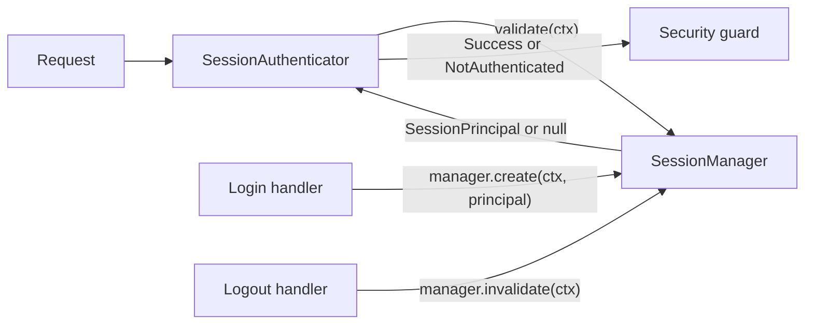

# Session

Session-based authentication via `javalin-security-session`. The extension is built around
one abstraction — `SessionManager` — that owns session **create**, **validate**, and
**invalidate**. `SessionAuthenticator` requires a `SessionManager` and simply delegates
`validate` on every request. You hold the same `SessionManager` reference in your login and
logout handlers to establish and destroy sessions.

The bundled [`HttpSessionManager`](#httpsessionmanager-default) is the servlet-session-backed
default (i.e. `ctx.sessionAttribute(...)`). Plug in any other implementation (Redis, in-memory,
signed cookie, …) without changing the rest of the extension.

Use this for **cookie-backed browser sessions** — classic server-side login flows. There is
**no built-in login form**, credential validator, CSRF protection, or opinionated distributed
store: validate credentials in your own `/login` route, then call `manager.create(ctx, principal)`.

!!! info "Session vs Opaque Token"
    Opaque tokens travel as bearer credentials you look up in your store. Session auth stores
    the principal via a `SessionManager` — by default in the HTTP session addressed by
    `JSESSIONID`. Prefer Session for browser apps; prefer Opaque Token for APIs and PATs.

## Architecture



There is exactly one lifecycle abstraction — the `SessionManager`. The `session { }` factory
returns a plain `AuthenticationStrategy.Sync` wrapping a `SessionAuthenticator`; login and
logout are done by calling the manager you already hold.

## Installation

Add the extension on top of [core](../getting-started/installation.md):

=== "Gradle (Kotlin DSL)"

    ```kotlin
    implementation("io.github.mzlnk:javalin-security-session:{{ versions.library }}")
    // plus javalin-security + Javalin + SLF4J from core
    ```

=== "Maven"

    ```xml
    <dependency>
      <groupId>io.github.mzlnk</groupId>
      <artifactId>javalin-security-session</artifactId>
      <version>{{ versions.library }}</version>
    </dependency>
    ```

## Minimal setup

Create a `SessionManager` (use `HttpSessionManager.of()` for the default), pass it to
`session { }`, and call it from your login / logout handlers:

=== "Kotlin"

    ```kotlin
    import io.github.mzlnk.javalin.security.authorization.Rules
    import io.github.mzlnk.javalin.security.session.*
    import io.github.mzlnk.javalin.security.security
    import io.javalin.Javalin
    import io.javalin.security.RouteRole

    enum class Role : RouteRole { USER, ADMIN }

    val sessions: SessionManager = HttpSessionManager.of()

    Javalin.create { config ->
        config.security { security ->
            security.rules.post("/login", Rules.allow())
            security.rules.post("/logout", Rules.allow())
            security.rules.get("/admin/*", Rules.hasRole(Role.ADMIN))
            security.http.authentication = session { it.sessionManager = sessions }
            security.http.fallback = Rules.authenticated()
        }
        config.routes.post("/login") { ctx ->
            // validate credentials yourself, then:
            sessions.create(ctx, SessionPrincipal("alice", setOf(Role.USER)))
            ctx.result("ok")
        }
        config.routes.post("/logout") { ctx ->
            sessions.invalidate(ctx)
            ctx.result("ok")
        }
    }
    ```

=== "Java"

    ```java
    import io.github.mzlnk.javalin.security.JavalinSecurityPlugin;
    import io.github.mzlnk.javalin.security.session.*;
    import io.github.mzlnk.javalin.security.authorization.Rules;
    import io.javalin.Javalin;
    import java.util.Set;

    SessionManager sessions = HttpSessionManager.of();

    Javalin.create(config -> {
        config.registerPlugin(new JavalinSecurityPlugin(security -> {
            security.rules.post("/login", Rules.allow());
            security.rules.post("/logout", Rules.allow());
            security.rules.get("/admin/*", Rules.hasRole(Role.ADMIN));
            security.http.authentication = SessionSecurity.session(cfg -> cfg.sessionManager = sessions);
            security.http.fallback = Rules.authenticated();
        }));
        config.routes.post("/login", ctx -> {
            // validate credentials yourself, then:
            sessions.create(ctx, new SessionPrincipal("alice", Set.of(Role.USER)));
            ctx.result("ok");
        });
        config.routes.post("/logout", ctx -> {
            sessions.invalidate(ctx);
            ctx.result("ok");
        });
    });
    ```

## Configuration

| Field                 | Default        | Effect                                                                                        |
|-----------------------|----------------|-----------------------------------------------------------------------------------------------|
| `sessionManager`      | *required*     | Storage strategy for sessions. Missing → `SecurityConfigurationException` at plugin start.    |
| `forbiddenHandler`    | bare HTTP 403  | Renders access denied for authenticated callers.                                              |
| `unauthorizedHandler` | bare HTTP 401  | Renders failed or absent authentication.                                                      |

`sessionManager` is the only required field. Everything about session lifetime, cookie name,
attribute key, and session-fixation defense lives on the `SessionManager` you pass in — see
below.

## `HttpSessionManager` (default)

`HttpSessionManager` is the built-in servlet-session-backed implementation. Configure it via
its builder:

=== "Kotlin"

    ```kotlin
    val sessions: SessionManager = HttpSessionManager.builder()
        .attributeKey("app.user")            // default: "javalin-security.session.principal"
        .rotateSessionIdOnCreate(true)       // default: true — session-fixation defense
        .invalidateSessionOnDestroy(true)    // default: true — HttpSession.invalidate() on logout
        .build()
    ```

=== "Java"

    ```java
    SessionManager sessions = HttpSessionManager.builder()
            .attributeKey("app.user")
            .rotateSessionIdOnCreate(true)
            .invalidateSessionOnDestroy(true)
            .build();
    ```

`HttpSessionManager.of()` returns the same defaults, and `HttpSessionManager.of("app.user")`
is shorthand for the attribute-key-only override.

## Plug in a custom `SessionManager`

`SessionManager` is a three-method interface:

```kotlin
interface SessionManager {
    fun create(context: Context, principal: SessionPrincipal)
    fun validate(context: Context): SessionPrincipal?
    fun invalidate(context: Context)
}
```

Everything else — the authenticator, the rule table, error rendering — stays the same.

=== "Kotlin"

    ```kotlin
    // Toy in-memory store keyed by an opaque cookie value.
    class InMemorySessionManager : SessionManager {
        private val store = ConcurrentHashMap<String, SessionPrincipal>()

        override fun create(ctx: Context, principal: SessionPrincipal) {
            val token = UUID.randomUUID().toString()
            store[token] = principal
            ctx.cookie("APPSESSION", token)
        }

        override fun validate(ctx: Context): SessionPrincipal? =
            ctx.cookie("APPSESSION")?.let(store::get)

        override fun invalidate(ctx: Context) {
            ctx.cookie("APPSESSION")?.also { store.remove(it) }
            ctx.removeCookie("APPSESSION")
        }
    }

    val sessions: SessionManager = InMemorySessionManager()
    ```

=== "Java"

    ```java
    SessionManager sessions = new SessionManager() {
        @Override public void create(Context ctx, SessionPrincipal principal) { /* … */ }
        @Override public SessionPrincipal validate(Context ctx) { return /* … */; }
        @Override public void invalidate(Context ctx) { /* … */ }
    };
    ```

## Identity

On success the strategy attaches a `SessionIdentity` whose `name` is the
`SessionPrincipal.subject` written at login:

```kotlin
config.routes.get("/me") { ctx ->
    ctx.result(ctx.identity<SessionIdentity>().name)
}
```

## Session lifetime

The extension does **not** implement application-level expiry. Session lifetime, cookie name,
and idle timeout are owned by the `SessionManager` — for the default `HttpSessionManager`
that means the servlet container (Jetty's session configuration). When the manager drops the
session, the next request authenticates as anonymous.

## Combining with credential validation

Validate passwords (or any other credential) in your `/login` handler, then call
`sessions.create`:

```kotlin
config.routes.post("/login") { ctx ->
    val username = ctx.formParam("username") ?: throw UnauthorizedResponse()
    val password = ctx.formParam("password") ?: throw UnauthorizedResponse()
    val user = users.find(username) ?: throw UnauthorizedResponse()
    if (!passwordEncoder.matches(password, user.password)) {
        throw UnauthorizedResponse()
    }
    sessions.create(ctx, SessionPrincipal(user.username, user.roles))
    ctx.result("ok")
}
```

The [Basic Auth](basic-auth.md) extension is a separate *request-header* strategy; you can
still reuse its `PasswordEncoder` / user-lookup ideas inside a session login handler.

## Security notes

!!! warning "Hardening checklist"
    - **Session fixation** — the default `HttpSessionManager` rotates the session id on create
      (`rotateSessionIdOnCreate` defaults to `true`). Custom `SessionManager` implementations
      should provide an equivalent guarantee.
    - **Serializable principal** — `SessionPrincipal` implements `Serializable`. Prefer enum
      `RouteRole`s when sessions may be replicated across nodes.
    - **Cookie flags** — set `Secure`, `HttpOnly`, and `SameSite` on the container's session
      cookie (`SessionCookieConfig` / Jetty session config) or, for custom managers, on
      whichever cookie you emit. The extension does not set cookie flags on your behalf.
    - **CSRF** — not included. Browser apps that use cookie sessions typically need a CSRF
      token (or `SameSite=Strict` / `Lax` plus careful CORS). Add that in your application.

## Custom 401 responses

Override `unauthorizedHandler` when you need a JSON body:

=== "Kotlin"

    ```kotlin
    session { s ->
        s.sessionManager = sessions
        s.unauthorizedHandler = UnauthorizedHandler { ctx, _ ->
            ctx.status(401).result("""{"error":"login_required"}""")
        }
    }
    ```

=== "Java"

    ```java
    SessionSecurity.session(s -> {
        s.sessionManager = sessions;
        s.unauthorizedHandler = (ctx, failure) ->
            ctx.status(401).result("{\"error\":\"login_required\"}");
    });
    ```

## Next steps

- [Access caller identity](../getting-started/access-caller-identity.md) — read
  `SessionIdentity` in handlers.
- [Authorization](../concepts/authorization.md) — pair sessions with the rule table.
- [Error handling](../concepts/error-handling.md) — customize 401 / 403 responses.
- [Custom authentication](../guides/custom-authentication.md) — when even a custom
  `SessionManager` is not enough.
