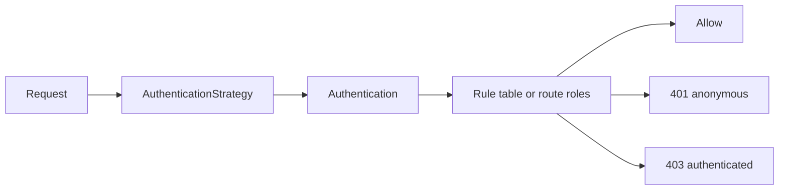

# Javalin Security

**Authentication and authorization for [Javalin 7](https://javalin.io/), in Java and Kotlin.**

`javalin-security` secures HTTP routes and WebSocket upgrades with pluggable authentication
strategies and role-based access rules, all configured inside `Javalin.create { … }`. Every code
sample on this site is shown in both languages.

## How it works



1. **Authentication.** An `AuthenticationStrategy` answers *who is calling?* and produces an
   `Authentication` (identity + roles). Without a strategy, every caller is anonymous.
2. **Authorization.** Route `RouteRole`s — or, if the route declares none, a path-based rule table —
   decide *is this caller allowed?* Unmatched requests are denied by default.

Extensions such as [Basic Auth](extensions/basic-auth.md) and [JWT](extensions/jwt/index.md) supply
ready-made strategies. You can also [write your own](guides/custom-authentication.md).

## Example

=== "Kotlin"

    ```kotlin
    import io.github.mzlnk.javalin.security.security
    import io.javalin.Javalin
    import io.javalin.http.HandlerType.GET
    import io.javalin.http.HandlerType.POST

    val app = Javalin.create { config ->
        config.security { security ->
            security.http { http ->
                http.authentication = myAuthenticationStrategy
                http.rules { r ->
                    r.add("/public/*", GET, r.allow)
                    r.add("/api/*", POST, r.authenticated)
                    r.add("/admin/*", r.hasRole(Role.ADMIN))
                    r.fallback = r.deny
                }
            }
        }
        config.routes.get("/public/info") { it.result("hello") }
    }.start(7070)
    ```

=== "Java"

    ```java
    import io.github.mzlnk.javalin.security.JavalinSecurityPlugin;
    import io.github.mzlnk.javalin.security.authorization.Rules;
    import io.javalin.Javalin;

    import static io.javalin.http.HandlerType.GET;
    import static io.javalin.http.HandlerType.POST;

    Javalin app = Javalin.create(config -> {
        config.registerPlugin(new JavalinSecurityPlugin(security -> security.http(http -> {
            http.authentication = myAuthenticationStrategy;
            http.rules(r -> {
                r.add("/public/*", GET, Rules.allow());
                r.add("/api/*", POST, Rules.authenticated());
                r.add("/admin/*", Rules.hasRole(Role.ADMIN));
                r.fallback = Rules.deny();
            });
        })));
        config.routes.get("/public/info", ctx -> ctx.result("hello"));
    }).start(7070);
    ```

## Supported versions

| Component   | Version                                       |
|-------------|-----------------------------------------------|
| Java        | **17+**                                       |
| Kotlin      | **2.4** (consumers may use any JVM language)  |
| Javalin     | **7.2.x**                                     |
| Coordinates | `io.github.mzlnk:javalin-security:1.0.0-SNAPSHOT` |

!!! warning "Bring your own runtime dependencies"
    Core and extensions do **not** bundle Javalin, SLF4J, or the JOSE libraries used by the JWT
    adapters — add them to your own build. See [Installation](getting-started/installation.md).

## Where to start

1. [Installation](getting-started/installation.md) — add the core artifact.
2. [Secure HTTP endpoints](getting-started/secure-http-endpoints.md) — protect routes end to end.
3. [Secure WebSocket endpoints](getting-started/secure-websocket-endpoints.md) — apply the same
   model to WebSocket upgrades.
4. [Access caller identity](getting-started/access-caller-identity.md) — read the authenticated
   user inside handlers.
5. [Authentication](concepts/authentication.md) and [Authorization](concepts/authorization.md) —
   the two concepts in depth.
6. **Extensions** and **Guides** — Basic Auth, JWT, CORS, testing.

For the generated KDoc, see the [API reference](https://mzlnk.github.io/javalin-security/api/).
